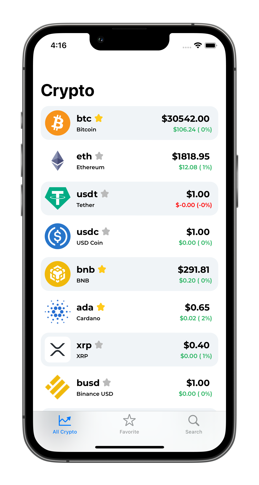
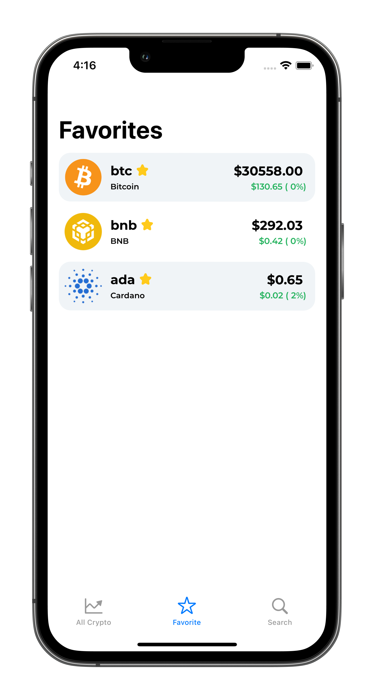
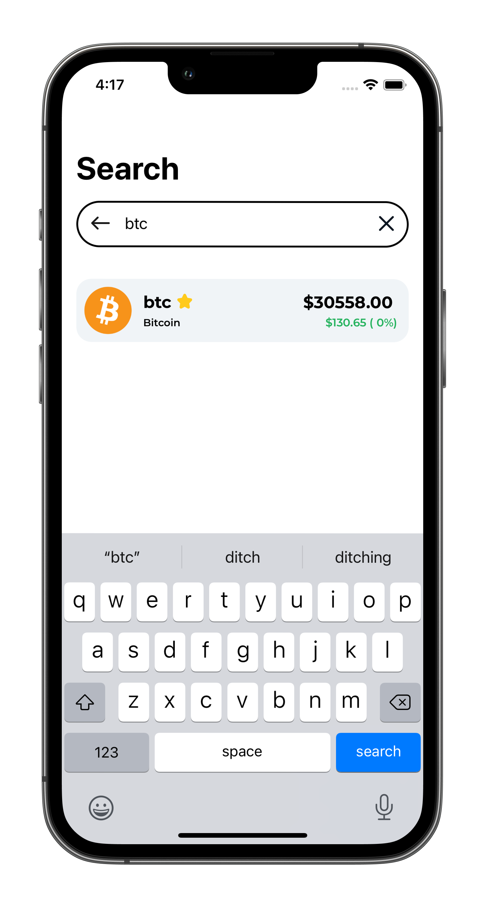
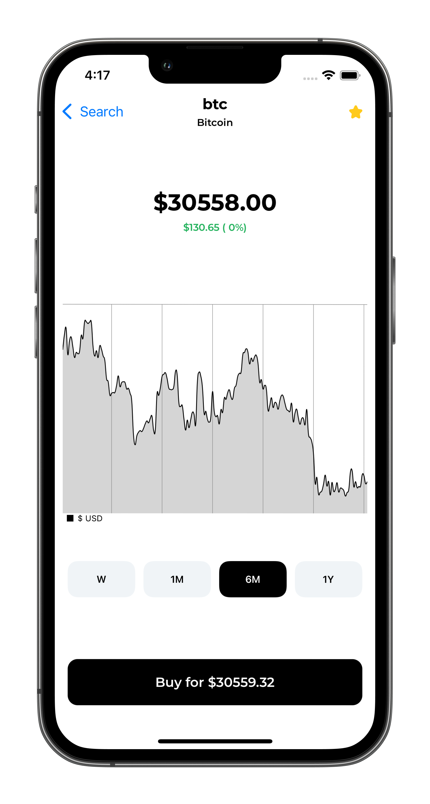
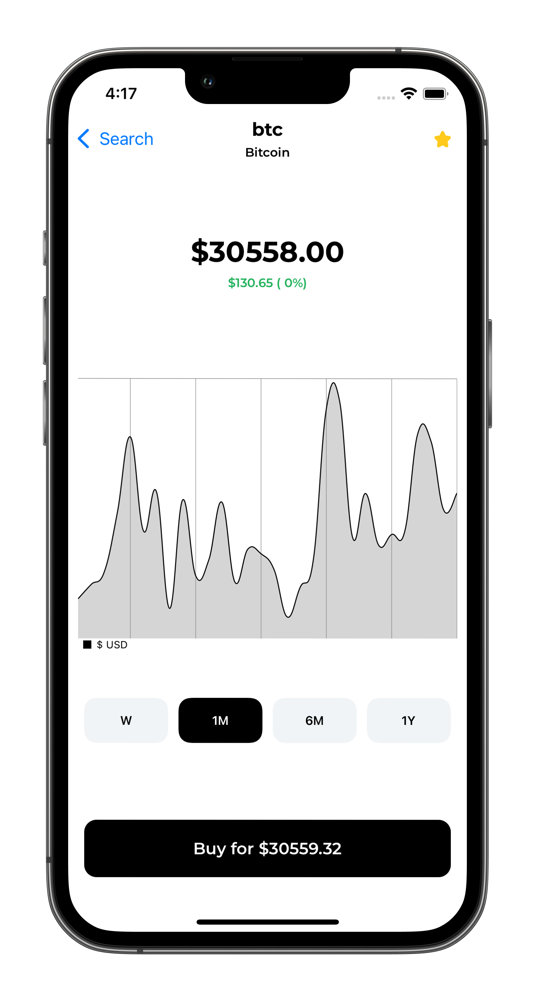
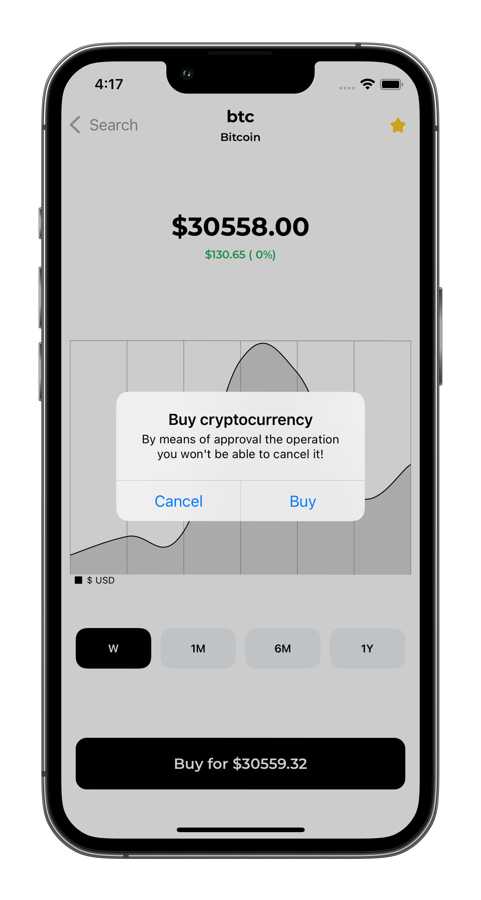

# CryptoStocks App 
 
    

        iOS pet project app for browsing cryptocurrencies (50 items) 
    

## Requierments
- IPhone 11+
- iOS 14.0+

## About
- UIKit 
- Programmatically designed UI with NSLayoutConstraints
- MVP architecture
- SPM dependencies: Charts, KingFisher
- Crypto list's API: https://api.coingecko.com/api/v3/coins/markets?vs_currency=usd&per_page=50
- Prices' API: https://api.coingecko.com/api/v3/coins/bitcoin/market_chart?vs_currency=usd&days=600&interval=daily
(where "bitcoin" - id of cryptocurrency)
- FavoritesService: NSNotificationCenter, FileManager, UserDefaults - optional.

        Code reviewers: tauypaldiyev, justadlet.
    

