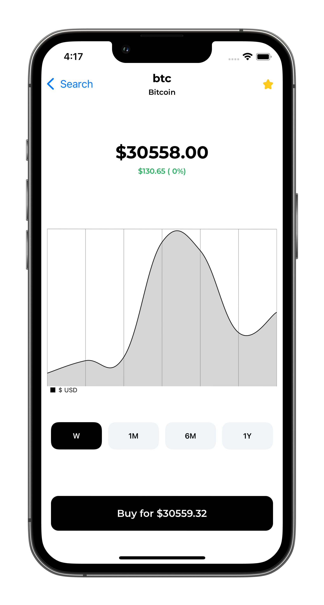

# CryptoStocks App 
 

    

        iOS pet project app for observing crypto stocks (100 items) 
    

## About
- UIKit 
- MVP architecture
- SPM dependencies: Charts, KingFisher

## Requierments
- IPhone 11+
- iOS 14.0+
